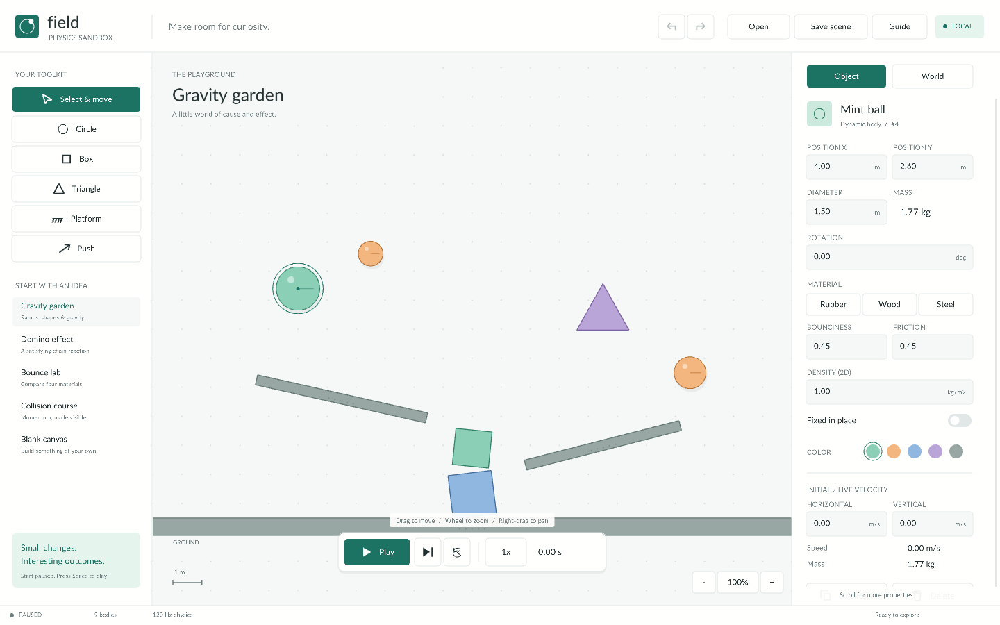

# Field — Physics Sandbox

A small desktop workbench for asking **“what happens if?”** Built with the actual C++ collision and rigid-body implementation from [2d-physicsengine](https://github.com/joaocarloscruz/2d-physicsengine).



## Run without a compiler

Extract the entire portable Windows ZIP into a writable folder, then open **Sandbox.exe**. Keep `assets` beside it. No C++ installation, installer, network connection, or separate engine DLL is required. Scene saves live in `scenes` and exported CSV files live in `exports`, beside the executable. The Windows build requires Windows 10/11 x64 and an OpenGL 3.3 capable graphics driver.

## Explore

- Draw circles, boxes, triangles, and fixed platforms. Click for a default size or drag to choose dimensions.
- Select a body to edit its position, dimensions, rotation, material, density, friction, bounce, and velocity. Click a numeric field, use **Ctrl+A** to replace the value, and **Enter** to apply. Escape cancels numeric editing.
- Drag bodies to move them; moving pauses the simulation. Simply selecting a body keeps playback running. **Push** applies an impulse in the direction you drag, including spin when applied off-center.
- Play, pause, advance exactly one 1/120-second step, or rewind to the start of a run. Choose 0.25×, 0.5×, 1×, or 2× playback speed. Editing while paused establishes a new rewind point.
- Start from Gravity garden, Domino effect, Bounce lab, Collision course, or a blank canvas with a ground plane. Replacing a scene is undoable.
- Use the **World** inspector for Earth/Moon/zero gravity, velocity arrows, motion trails, energy history, collision counts, and **Export measurements**. Scroll the inspector when necessary.
- Save named `.field` scenes and reopen them from the app, or drop a scene file onto the window. Saves preserve live body state and world gravity; they open paused with the timer reset. Replacing a save retains one `.bak` recovery copy. Scene changes and deletes support 64 levels of undo/redo.

## Controls

| Control | Action |
| --- | --- |
| V / C / B / T / P / F | Select / circle / box / triangle / platform / push |
| Space | Play or pause |
| . | One physics step while paused |
| R | Rewind this experiment |
| Mouse wheel / right or middle drag | Zoom at cursor / pan |
| Home | Reset camera |
| Arrow keys | Move selected body by 0.1 m |
| Ctrl+D / Delete | Duplicate / remove selected body |
| Ctrl+Z / Ctrl+Y | Undo / redo |
| Ctrl+S / Ctrl+O | Save / open |
| F1 / Escape | Help / cancel or deselect |

## Measurements and limits

Distances are metres, time is seconds, and mass is kilograms. Positive X points right and **positive Y points down**. The dotted grid has 1 m spacing. Density is area density in kg/m², appropriate to this 2D engine. Kinetic energy includes translational and rotational energy. CSV export captures each body's current position, velocity, speed, orientation, spin, mass, and kinetic energy, with units in the column headers. The energy plot samples simulation time and shows up to 12 seconds of history.

This is a rigid-body sandbox, not a fluid or joint editor. The engine is stepped at 120 Hz with 16 solver iterations. It uses discrete collision detection; very thin geometry, large overlaps, extreme mass ratios, or high speeds can produce artifacts. Linear and angular speeds are limited to 30 m/s and 30 rad/s. There are at most 250 bodies; shape dimensions are at least 0.15 m. There are no invisible boundary walls. You can pan to objects outside the initial view or draw your own platforms.

## Build from source

Dependencies are fetched by CMake and pinned to immutable revisions:

- Physics engine: `ed169e7caa2c58d717ad63b0950775a3de6732bd`
- raylib 5.5: `c1ab645ca298a2801097931d1079b10ff7eb9df8`

CMake 3.24+, Git, and a C++17 compiler are required **only to build**. The engine sources remain unchanged: `sandbox_engine` statically compiles the upstream physics implementation. `Simulation` uses its `World`, `RigidBody`, `Gravity`, shapes, and solver, owning shapes for at least as long as the world holds bodies. No substitute JavaScript physics or handwritten replacement collision solver is used.

```sh
cmake -S . -B build -DCMAKE_BUILD_TYPE=Release
cmake --build build --config Release --parallel
ctest --test-dir build -C Release --output-on-failure
cmake --install build --config Release --component Runtime --prefix dist/Field
```

On Windows, the validated portable build uses LLVM-MinGW with Ninja:

```sh
cmake -S . -B build -G Ninja -DCMAKE_BUILD_TYPE=Release -DCMAKE_C_COMPILER=clang -DCMAKE_CXX_COMPILER=clang++
cmake --build build --parallel
```

On Linux, raylib also needs the usual X11/OpenGL development dependencies. Core integration tests can run without raylib or a display:

```sh
cmake -S . -B build-core -DSANDBOX_BUILD_APP=OFF
cmake --build build-core --parallel
ctest --test-dir build-core --output-on-failure
```

## Verification

The model integration suite covers analytical free fall, equal-mass elastic collisions, five presets run for ten seconds each, fixed-body invariance, deletion/ownership, undo/redo, rotated hit testing, save round trips and backups, CSV exports, and invalid scene rejection.

`Sandbox.exe --smoke-test` runs deterministic UI checks inside a hidden application window. It uses raylib's internal event replay, without Windows input injection or moving the system cursor. This verifies actual toolbar, canvas, numeric inspector, keyboard, playback, and save/load code paths. It requires a graphics context and uses a reserved temporary scene named `__field_smoke_scene` in the build's `scenes` folder.

App-generated screenshots are available for visual inspection:

```sh
Sandbox.exe --frames 3 --screenshot field.png
Sandbox.exe --frames 3 --width 1120 --height 740 --screenshot compact.png
```

`--preset 0..4` selects a starting experiment. Screenshot and smoke-test modes use hidden windows.

Source layout: `scene.*` owns simulation, persistence, presets and history; `ui.*` owns rendering and interaction; `main.cpp` owns startup and command-line options. See [THIRD_PARTY.md](THIRD_PARTY.md) for licenses.
